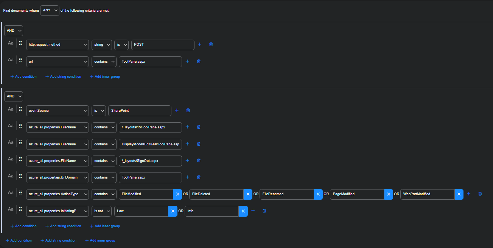

# Detections — SharePoint “ToolShell”


---

## Data Sources
- **Microsoft Defender for Endpoint (Advanced Hunting)** — KQL
- **Stellar Cyber** — ATH rule (builder or YAML-like sketch)

---

## 1) KQL — ASPX drop into SharePoint LAYOUTS
**Goal:** catch suspicious writes of ASPX files to the global LAYOUTS path (common web‑shell landing spot).

```kusto
// On‑prem SharePoint servers (adjust 14/15/16 version in path for your farm)
DeviceFileEvents
| where FolderPath matches regex @"Web Server Extensions\\\d+\\TEMPLATE\\LAYOUTS"
| where FileName endswith ".aspx"
| where ActionType in~ ("FileCreated","FileModified","FileRenamed")
| project Timestamp, DeviceName, AccountName,
          InitiatingProcessFileName, InitiatingProcessCommandLine,
          FileName, FolderPath, ActionType, SHA256
| order by Timestamp desc
```


---

## 2) KQL — IIS spawning PowerShell/CMD (encoded commands)
**Goal:** unusual **`w3wp.exe` → `powershell.exe`/`cmd.exe`** chains with `-EncodedCommand` usage.

```kusto
DeviceProcessEvents
| where InitiatingProcessFileName =~ "w3wp.exe"
| where FileName in~ ("powershell.exe","pwsh.exe","cmd.exe")
| extend Encoded = iif(CommandLine has "-EncodedCommand" or CommandLine has "-enc", true, false)
| project Timestamp, DeviceName, AccountName,
          Parent=InitiatingProcessFileName, FileName, CommandLine, Encoded,
          InitiatingProcessCommandLine
| order by Timestamp desc
```


---

## 3) (Optional) KQL — clear‑text egress to suspicious infra
**Goal:** flag outbound HTTP from SharePoint/IIS hosts to known‑bad infrastructure.

```kusto
let watchHosts = dynamic(["trryuphx.requestrepo.com","mpf1oyds.requestrepo.com"]);  // add exact subdomains
let watchPorts = dynamic([10888]);
DeviceNetworkEvents
| where (RemoteUrl has_any (watchHosts)) or (RemotePort in (watchPorts))
| where InitiatingProcessFileName in~ ("w3wp.exe","powershell.exe","cmd.exe")
| project Timestamp, DeviceName, RemoteUrl, RemoteIP, RemotePort,
          InitiatingProcessFileName, InitiatingProcessCommandLine
| order by Timestamp desc
```


---

## 4) Stellar Cyber (ATH) — two simple rules

### 4.1 ToolPane POST + page mutation 
```yaml
name: SharePoint ToolPane POST + Page Mutation (ToolShell)
when:
  and:
    - http.request.method == "POST"
    - url contains "ToolPane.aspx"
  and:
    - eventSource == "SharePoint"
    - azure_all_properties.ActionType in
        ["FileModified","FileDeleted","FileRenamed","PageModified","WebPartModified"]
    - azure_all_properties.FileName contains_any
        ["/_layouts/15/ToolPane.aspx","DisplayMode=Edit","/_layouts/SignOut.aspx"]
    - azure_all_properties.UriDomain contains "ToolPane.aspx"
    - azure_all_properties.InitiatingPSeverity not in ["Low","Info"]
group_by: [client.ip, user, url]
threshold:
  count >= 3 within 10m
severity: high
notes: >
  Correlate with w3wp→powershell/cmd and LAYOUTS ASPX writes to reduce FPs.
```

### 4.2 LAYOUTS ASPX write on SharePoint host
```yaml
name: SharePoint LAYOUTS ASPX Write
when:
  and:
    - eventSource in ["EDR","Defender","Sysmon"]   # adjust to your source naming
    - file.path contains "Web Server Extensions"
    - file.path contains "TEMPLATE\LAYOUTS"
    - file.name endswith ".aspx"
    - file.action in ["FileCreated","FileModified","FileRenamed"]
group_by: [host.name, file.path, file.name]
threshold:
  count >= 1 within 15m
severity: critical
notes: >
  High signal on server roles. Add allowlists for admin deployments/build agents.
```

---

## 5) Screenshot


*Figure — ATH rule builder targeting POST + ToolPane and SharePoint edit ops.*


---

## 6) IOCs

### Network
- **Domains**
  - `trryuphx.requestrepo[.]com`
  - `mpf1oyds.requestrepo[.]com`
  - `cdn-chromos.s3.amazonaws[.]com`
- **Ports/URLs**
  - Small HTTP service on **`:10888`** (paths like `/asx`, `/asd`, `/1` … `/4`)
- **IPs**
- `96.9.125[.]147`
- `107.191.58[.]76`
- `104.238.159[.]149` 
- `139.59.11[.]66`
- `154.223.19[.]106`
- `103.151.172[.]92`
- `45.191.66[.]77`
- `83.136.182[.]237`
- `162.248.74[.]92`
- `38.54.106[.]11`
- `206.166.251[.]228`
- `45.77.155[.]170`
- `64.176.50[.]109`
- `149.28.17[.]188`
- `173.239.247[.]32`
- `109.105.193[.]76`
- `2.56.190[.]139`
- `141.164.60[.]10`
- `124.56.42[.]75`
- `103.186.30[.]186`

### File Paths (Windows)
- `C:\Program Files\Common Files\microsoft shared\Web Server Extensions\16\TEMPLATE\LAYOUTS\spinstall0.aspx`
- `C:\inetpub\wwwroot\wss\VirtualDirectories\<site-id>\App_GlobalResources\0.css`
- `C:\Users\<service>\AppData\Local\` *(staging of EXE/DLL payloads)*

### Filenames (contextual)
- `spinstall0.aspx`
- `SPlog.exe`, `log.dll`, `Product.Wsc.dll`, `nvsmartmax64.dll`, `txmlutil.dll`, `1.exe`
- `.1.avdtwnuschaqsaccnjdxsukiwoqbufpc.__relocated__.exe` *(suspicious relocated EXE)*

### Processes / Behaviors
- `w3wp.exe` → `powershell.exe` / `cmd.exe`
- PowerShell with `-EncodedCommand` and decoded strings including `whoami`, `systeminfo`, `tasklist`, `netstat`, directory listings


---

## 7) Attribution
*“KQL adapted from \<Ontinue-ATO/# Threat Briefing: CVE-2025-53770 “ToolShell” – Active SharePoint Zero Day, 2025\> ([Threat Briefing: CVE-2025-53770 “ToolShell” – Active SharePoint Zero Day | Ontinue](https://www.ontinue.com/resource/toolshell-active-sharepoint-zero-day/)). Tweaked for our env (paths/fields).”*

