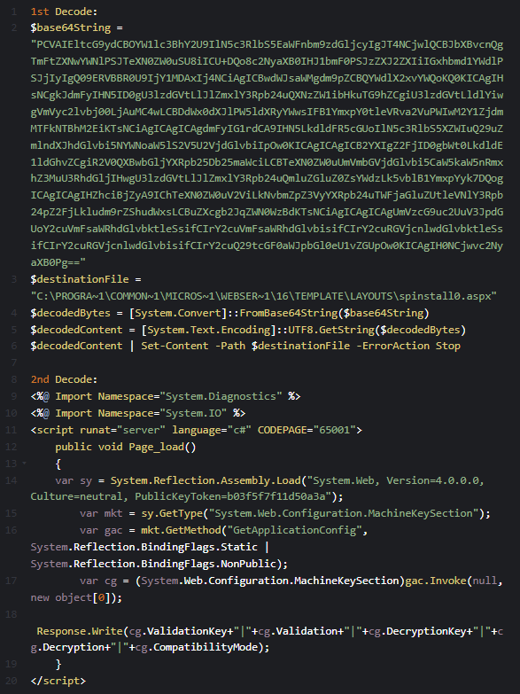

# Case Study 001 — SharePoint “ToolShell” Exploitation Attempt

> **TL;DR**: Suspected post-exploitation activity on a SharePoint host: `w3wp.exe` spawning PowerShell/`cmd.exe`, host recon + cleartext exfil, staged binaries, and a probable ASPX web shell drop into **LAYOUTS**. No sensitive data or PoC code included.

**Status:** Analyzed (July 2025)  
**Severity:** High (post-exploitation behaviors observed)  
**Surface:** SharePoint on IIS (`w3wp.exe`)  
**Framework:** MITRE ATT&CK

---

## Table of Contents
```toc
style: bullet
min_depth: 1
max_depth: 3
```


---
## 1) Overview

A chain of 2025 SharePoint issues dubbed “ToolShell” was publicly tracked:

- **CVE-2025-49706** — auth bypass (enables unauthenticated reachability)  
- **CVE-2025-49704** — arbitrary file write → potential RCE  
- **CVE-2025-53770** — variant related to 49704 (fuzzing-derived)  
- **CVE-2025-53771** — variant related to 49706


---

## 2) Evidence & Observables

**Telemetry sources**
- XDR alert (High)
- Defender for Endpoint process tree showing **`w3wp.exe` → `powershell.exe` / `cmd.exe`**

**Representative behaviors**
- **Recon & exfil** (cleartext HTTP POST): `whoami /all`, `systeminfo`, `tasklist /v`, `netstat -ano`, and directory listings (SharePoint/IIS paths)
- **App/IIS enumeration**: `appcmd list app ...`, listings under `C:\inetpub\wwwroot\wss\VirtualDirectories\...` and `...\App_GlobalResources\`
- **Artifact staging**: EXE/DLL downloads over HTTP into `C:\Users\<svc>\AppData\Local\...` and `C:\ProgramData\...`
- **Web shell write attempt**:
  - Decoded `-EncodedCommand` writes **`spinstall0.aspx`** into SharePoint **LAYOUTS** (globally served)
  - A `0.css` drop in `App_GlobalResources\` (likely write test/marker)

#### **Screenshot**


*Figure — Decoded Command Lines*


---

## 3) ATT&CK Mapping (High-level)

- **Initial Access**: T1190 Exploit Public-Facing App (SharePoint)  
- **Execution**: T1059.001 PowerShell; T1059 Cmd  
- **Discovery**: T1082 System Info; T1057 Process Discovery; T1046 Network Service Scanning (inferred by `netstat`)  
- **Collection/Exfiltration**: T1041 Exfiltration Over C2 Channel (HTTP)  
- **Defense Evasion**: T1140 Deobfuscate/Decode (PowerShell `EncodedCommand`)  
- **Persistence**: T1505.003 Server-Side Component (ASPX web shell in LAYOUTS)  
- **C2**: T1071.001 Web Protocols (HTTP POST to external host)


---

## 4) Detection Opportunities

> Use these as **hypotheses** or starting points—adapt to your SIEM/EDR telemetry model.

**A. Process ancestry (IIS → PS/CMD)**  
- Parent `Image` = `w3wp.exe` spawning `powershell.exe` or `cmd.exe`
- PowerShell with `-EncodedCommand` or suspicious `WebRequest` usage

**B. Suspicious file writes in SharePoint paths**  
- New/modified `*.aspx` in:  
  `C:\Program Files\Common Files\microsoft shared\Web Server Extensions\16\TEMPLATE\LAYOUTS\`
- Unexpected `*.css` or `*.aspx` under `...\App_GlobalResources\`

**C. Cleartext outbound from server roles**  
- HTTP/odd ports (e.g., `:10888`) from SharePoint hosts to external IPs/domains  
- POST bodies containing `whoami/systeminfo/tasklist/netstat` outputs

**D. IIS/SharePoint enumeration**  
- `appcmd.exe list app` invoked by non-admin service context
- Directory listings of `\VirtualDirectories\` soon followed by network POSTs

**E. Staged binaries under service profiles**  
- New EXE/DLL in `AppData\Local\` or `ProgramData\` tied to recent `w3wp.exe` activity


---

## 5) Response & Remediation

**Immediate**
- Quarantine or EDR isolate the affected host (maintenance window permitting)
- Reset all user credentials
- Run a full security scan and remove all the malicious files (.dll, .exe and .aspx)
- Renew SharePoint Server machine keys
- Renew IIS on host server after key renewal
- Block egress to suspicious domains/IPs; capture full PCAP if available
- Snapshot volatile data (process list, net connections, open handles), then acquire triage image

**Hunt & Scope**
- Search for additional `.aspx` drops in LAYOUTS and web app roots
- Review IIS logs for anomalous requests to newly created pages
- Trace similar `w3wp.exe → powershell.exe` trees across farm/cluster nodes

**Hardening**
- Apply vendor patches/advisories for CVE-2025-49706/49704 + variants
- Enforce latest SharePoint CUs; restrict “write” permissions to app roots
- Constrain PowerShell on servers (Constrained Language Mode, script block logging)
- Web publishing best practices: WAF rules, request filtering, and disable legacy endpoints


---

## 6) Timeline

- **2025-07-22** — Suspicious telemetry detected (XDR)  
- **2025-07-24** — Lab replication & artifact review  
- **2025-07-xx** — Mitigations applied; indicators shared with SecOps


---

## 7) Indicators

- **Paths**: `...\LAYOUTS\spinstall0.aspx`, `...\App_GlobalResources\0.css`  
- **Processes**: `w3wp.exe` → `powershell.exe` / `cmd.exe`  
- **Network**: `hxxp://<redacted_domain_or_ip>:10888/...` (HTTP POSTs)  
- **Files**: `SPlog.exe`, `log.dll`, `Product.Wsc.dll`, `nvsmartmax64.dll`, `txmlutil.dll` (filenames only; treat as contextual)


---

## References

- NVD: [CVE-2025-49706](https://nvd.nist.gov/vuln/detail/CVE-2025-49706 "https://nvd.nist.gov/vuln/detail/CVE-2025-49706")— Authentication bypass
- NVD: [CVE-2025-49704](https://nvd.nist.gov/vuln/detail/CVE-2025-49704 "https://nvd.nist.gov/vuln/detail/CVE-2025-49704") — Arbitrary file write → RCE
- NVD: [CVE-2025-53770](https://nvd.nist.gov/vuln/detail/CVE-2025-53770 "https://nvd.nist.gov/vuln/detail/CVE-2025-53770") — Variant related to file write
- CVE-2025-53771 — Variant related to auth bypass
- MITRE ATT&CK: https://attack.mitre.org/
- Article Ref: [ToolShell: A SharePoint RCE chain actively exploited](https://www.varonis.com/blog/toolshell-sharepoint-rce#detection-and-mitigation)


---

## Appendix A — Decoded Command


*Figure — Decoded Command Lines*


---

### Ethics & Disclosure

This case study omits exploit code and sensitive identifiers and was prepared in line with responsible disclosure practices. The intent is to help defenders recognize and mitigate similar activity, not to enable misuse.
